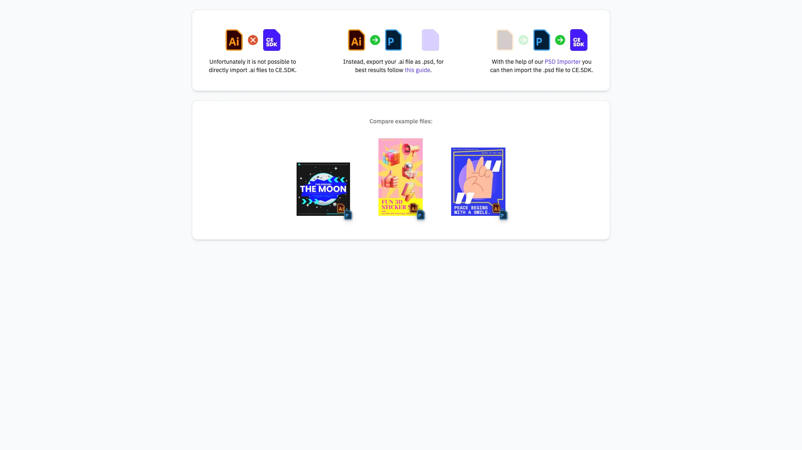

# Design Editor Starter Kit

Create stunning graphics and layouts for your web app — add text, images, shapes, and export to multiple formats. Built with [CE.SDK](https://img.ly/creative-sdk) by [IMG.LY](https://img.ly), runs entirely in the browser with no server dependencies.



## Getting Started

### Clone the Repository

```bash
git clone https://github.com/imgly/demo-illustrator-template-import-react-web.git
cd demo-illustrator-template-import-react-web
```

### Install Dependencies

```bash
npm install
```

### Download Assets

CE.SDK requires engine assets (fonts, icons, UI elements) served from your `public/` directory.

```bash
curl -O https://cdn.img.ly/packages/imgly/cesdk-js/$UBQ_VERSION$/imgly-assets.zip
unzip imgly-assets.zip -d public/
rm imgly-assets.zip
```

### Run the Development Server

```bash
npm run dev
```

Open `http://localhost:5173` in your browser.

## Configuration

### Loading Content

Load content into the editor using one of these methods:

```typescript
// Create a blank design canvas
await cesdk.createDesignScene();

// Load from a template archive
await cesdk.load('https://example.com/template.zip');

// Load from a scene file
await cesdk.load('https://example.com/scene.json');

// Load from an image
await cesdk.createFromImage('https://example.com/image.jpg');
```

See [Open the Editor](https://img.ly/docs/cesdk/web/guides/open-editor/) for all loading methods.

### Theming

```typescript
cesdk.ui.setTheme('dark'); // 'light' | 'dark' | 'system'
```

See [Theming](https://img.ly/docs/cesdk/web/ui-styling/theming/) for custom color schemes and styling.

### Localization

```typescript
cesdk.i18n.setTranslations({
  de: { 'common.save': 'Speichern' }
});
cesdk.i18n.setLocale('de');
```

See [Localization](https://img.ly/docs/cesdk/web/ui-styling/localization/) for supported languages and translation keys.

## Architecture

```
src/
├── app/                          # Demo application
├── imgly/
│   ├── config/
│   │   ├── actions.ts                # Export/import actions
│   │   ├── features.ts               # Feature toggles
│   │   ├── i18n.ts                   # Translations
│   │   ├── plugin.ts                 # Main configuration plugin
│   │   ├── settings.ts               # Engine settings
│   │   └── ui/
│   │       ├── canvas.ts                 # Canvas configuration
│   │       ├── components.ts             # Custom component registration
│   │       ├── dock.ts                   # Dock layout configuration
│   │       ├── index.ts                  # Combines UI customization exports
│   │       ├── inspectorBar.ts           # Inspector bar layout
│   │       ├── navigationBar.ts          # Navigation bar layout
│   │       └── panel.ts                  # Panel configuration
│   └── index.ts                  # Editor initialization function
└── index.tsx                 # Application entry point
```

## Key Capabilities

- **Text Editing** – Typography with fonts, styles, and effects
- **Image Placement** – Add, crop, and arrange images
- **Shapes & Graphics** – Vector shapes and design elements
- **Templates** – Start from pre-built design templates
- **Multi-Page** – Create multi-page documents
- **Export** – PNG, JPEG, PDF with quality controls

## Prerequisites

- **Node.js v22+** with npm – [Download](https://nodejs.org/)
- **Supported browsers** – Chrome 114+, Edge 114+, Firefox 115+, Safari 15.6+

## Troubleshooting

| Issue               | Solution                                  |
| ------------------- | ----------------------------------------- |
| Editor doesn't load | Verify assets are accessible at `baseURL` |
| Assets don't appear | Check `public/assets/` directory exists   |
| Watermark appears   | Add your license key                      |

## Documentation

For complete integration guides and API reference, visit the [Design Editor Documentation](https://img.ly/docs/cesdk/starterkits/design-editor/).

---

<p align="center">Built with <a href="https://img.ly/creative-sdk?utm_source=github&utm_medium=project&utm_campaign=demo-illustrator-template-import">CE.SDK</a> by <a href="https://img.ly?utm_source=github&utm_medium=project&utm_campaign=demo-illustrator-template-import">IMG.LY</a></p>

## Demo Assets

The demo assets for this starter kit load from the IMG.LY CDN by default —
nothing to configure. If you want to own them — edit them, meet compliance
requirements, or remove the CDN dependency for production — eject them
(the archive contains only this kit's files):

```bash
# Download this starter kit's demo assets
curl -O https://staticimgly.com/imgly/cesdk-web-examples-data/1.82.0-rc.0/demo-illustrator-template-import/demo-assets.zip
unzip demo-assets.zip -d demo-assets
rm demo-assets.zip
```

Upload the extracted files to your own server or CDN, then point the app
at them via `.env`:

```bash
VITE_DEMO_ASSETS_BASE_URL=https://cdn.yourdomain.com/demo-assets
```

The default URL is the `DEMO_ASSETS_BASE_URL` constant in `src/app/App.tsx` if you
prefer changing it in code.

The demo assets are intended for development and prototyping — replace
them with your own content or licensed stock assets before shipping to
production (see `DEMO-ASSETS-NOTICE.txt` in the download). This applies in
particular to media such as music tracks and stock imagery.
