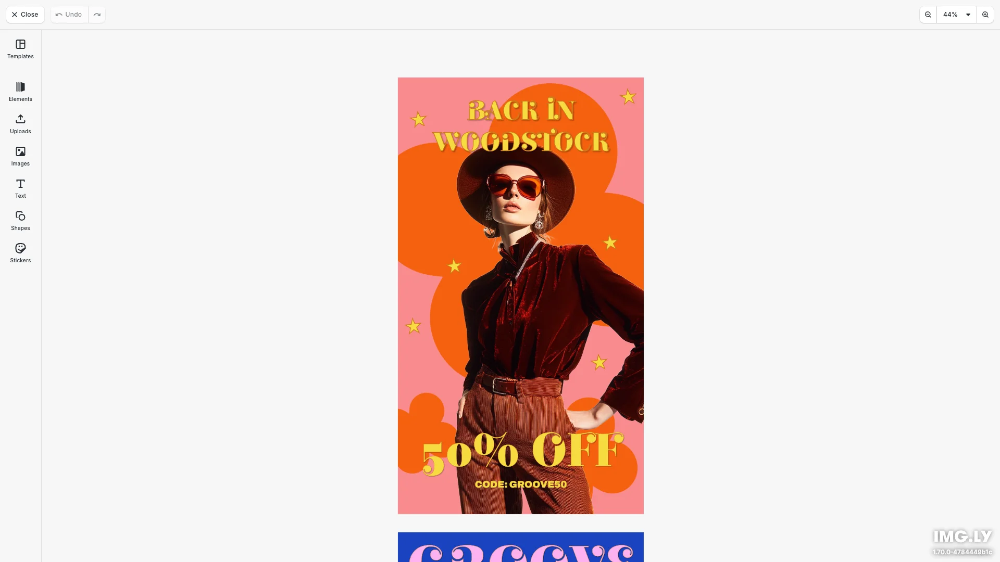

# Premium Templates Editor Demo

Add custom premium templates as an asset source in CE.SDK's design editor. Templates are fetched from a CDN and displayed in the templates dock, ready for users to apply with a single click. Built with [CE.SDK](https://img.ly/creative-sdk) by [IMG.LY](https://img.ly), runs entirely in the browser with no server dependencies.

<p>
  <a href="https://img.ly/docs/cesdk/web/integrations/custom-asset-sources/">Documentation</a> |
  <a href="https://img.ly/showcases/cesdk">Live Demo</a>
</p>



## Getting Started

### Clone the Repository

```bash
git clone https://github.com/imgly/demo-premium-templates-react-web.git
cd demo-premium-templates-react-web
```

### Install Dependencies

```bash
npm install
```

### Download Assets

CE.SDK requires engine assets (fonts, icons, UI elements) served from your `public/` directory.

```bash
curl -O https://cdn.img.ly/packages/imgly/cesdk-js/$UBQ_VERSION$/imgly-assets.zip
unzip imgly-assets.zip -d public/
rm imgly-assets.zip
```

### Run the Development Server

```bash
npm run dev
```

Open `http://localhost:5173` in your browser.

## Adding Premium Templates

The key feature of this demo is adding custom templates as an asset source. Templates are fetched from a CDN and integrated into the templates dock.

### Template Configuration

```typescript
// Configure your templates CDN URL
const PREMIUM_TEMPLATES_BASE_URL =
  'https://staticimgly.com/imgly/premium-templates/1.0.0';
```

### How It Works

1. **Fetch Templates** - Template metadata is loaded from `content.json` on your CDN
2. **Register Asset Source** - Templates are registered with the engine's asset system
3. **Display in Dock** - Templates appear in the templates dock with thumbnails
4. **Apply Templates** - Clicking a template loads its archive into the editor

### Adding Templates Programmatically

```typescript
// Add a local asset source for templates
engine.asset.addLocalSource('my.templates', [], async (asset) => {
  // Load the template archive when applied
  await engine.scene.loadFromArchiveURL(asset.meta.uri);
  return undefined;
});

// Add a template to the source
engine.asset.addAssetToSource('my.templates', {
  id: 'template-1',
  label: { en: 'My Template' },
  groups: ['category/business'],
  meta: {
    uri: 'https://example.com/templates/business-card.archive',
    thumbUri: 'https://example.com/templates/business-card-thumb.png'
  }
});

// Register in the templates library
cesdk.ui.updateAssetLibraryEntry('ly.img.templates', {
  sourceIds: ({ currentIds }) => [...currentIds, 'my.templates']
});
```

### Template Archive Format

Templates use the `.archive` format which bundles:
- Scene JSON with block definitions
- All referenced images and assets
- Font files used in the design

See [Creating Archives](https://img.ly/docs/cesdk/web/guides/archives/) for creating your own templates.

## Configuration

### Loading Content

Load content into the editor using one of these methods:

```typescript
// Create a blank design canvas
await cesdk.createDesignScene();

// Load from a template archive
await cesdk.loadFromArchiveURL('https://example.com/template.zip');

// Load from a scene file
await cesdk.loadFromURL('https://example.com/scene.json');

// Load from an image
await cesdk.createFromImage('https://example.com/image.jpg');
```

See [Open the Editor](https://img.ly/docs/cesdk/web/guides/open-editor/) for all loading methods.

### Theming

```typescript
cesdk.ui.setTheme('dark'); // 'light' | 'dark' | 'system'
```

See [Theming](https://img.ly/docs/cesdk/web/ui-styling/theming/) for custom color schemes and styling.

## Architecture

```
src/
├── app/                          # Demo application
├── imgly/
│   ├── config/
│   │   ├── actions.ts                # Export/import actions
│   │   ├── features.ts               # Feature toggles
│   │   ├── i18n.ts                   # Translations
│   │   ├── plugin.ts                 # Main configuration plugin
│   │   ├── settings.ts               # Engine settings
│   │   └── ui/
│   │       ├── canvas.ts                 # Canvas configuration
│   │       ├── components.ts             # Custom component registration
│   │       ├── dock.ts                   # Dock layout configuration
│   │       ├── index.ts                  # Combines UI customization exports
│   │       ├── inspectorBar.ts           # Inspector bar layout
│   │       ├── navigationBar.ts          # Navigation bar layout
│   │       └── panel.ts                  # Panel configuration
│   └── index.ts                  # Editor initialization function
└── index.tsx                 # Application entry point
```

## Key Capabilities

- **Premium Templates** - Add custom templates from your CDN
- **Template Categories** - Organize templates with groups and labels
- **Text Editing** - Typography with fonts, styles, and effects
- **Image Placement** - Add, crop, and arrange images
- **Shapes & Graphics** - Vector shapes and design elements
- **Multi-Page** - Create multi-page documents
- **Export** - PNG, JPEG, PDF with quality controls

## Prerequisites

- **Node.js v20+** with npm – [Download](https://nodejs.org/)
- **Supported browsers** – Chrome 114+, Edge 114+, Firefox 115+, Safari 15.6+

## Troubleshooting

| Issue | Solution |
|-------|----------|
| Editor doesn't load | Verify assets are accessible at `baseURL` |
| Templates don't appear | Check CDN URL is accessible and returns valid JSON |
| Watermark appears | Add your license key |

## Documentation

For complete integration guides and API reference, visit the [Custom Asset Sources Documentation](https://img.ly/docs/cesdk/web/integrations/custom-asset-sources/).

---

<p align="center">Built with <a href="https://img.ly/creative-sdk?utm_source=github&utm_medium=project&utm_campaign=demo-premium-templates">CE.SDK</a> by <a href="https://img.ly?utm_source=github&utm_medium=project&utm_campaign=demo-premium-templates">IMG.LY</a></p>
